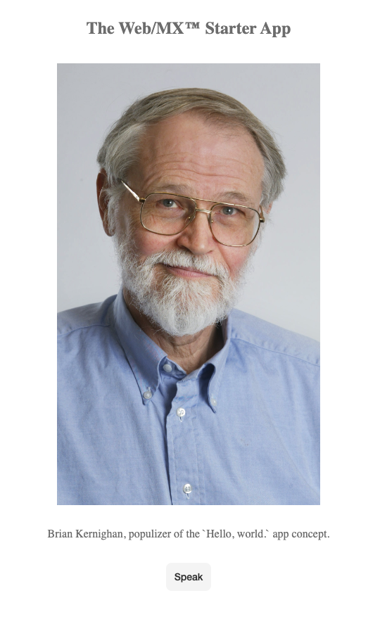

# Web/MX&trade; Starter App
A minimal [Web/MX&trade;](https://github.com/kennytilton/web-mx) starter app.

#### Installation
Clone this repo. In a terminal window:
```
git clone https://github.com/kennytilton/web-mx-starter.git
```
#### Running the app
To run the starter app, in the same terminal window:
```
cd web-mx-starter
clojure -M -m figwheel.main --build hello --repl
```
The above will work for a minute, then produce:
```
[Figwheel] Validating figwheel-main.edn
[Figwheel] figwheel-main.edn is valid \(ツ)/
[Figwheel] Compiling build hello to "target/public/cljs-out/hello-main.js"
[Figwheel] Successfully compiled build hello to "target/public/cljs-out/hello-main.js" in 1.274 seconds.
[Figwheel] Watching paths: ("src") to compile build - hello
[Figwheel] Starting Server at http://localhost:9500
[Figwheel] Starting REPL
Prompt will show when REPL connects to evaluation environment (i.e. a REPL hosting webpage)
...SNIP...
Opening URL http://localhost:9500/hello.html
ClojureScript 1.10.773
cljs.user=>
```
This will leave the terminal with a CLJS REPL running, and open the app in a browser near you:



Leave the REPL running while developing. Recompilation messages/errors will appear here. Use Control-D to exit.

Visit  [Web/MX&trade;](https://github.com/kennytilton/web-mx) for documentation, or visit the #matrix xhannel on the Clojurians Slack for help.
